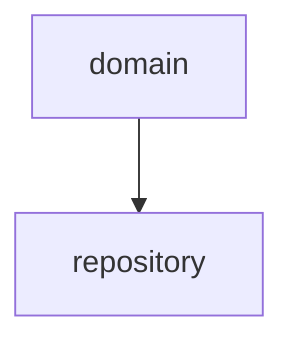
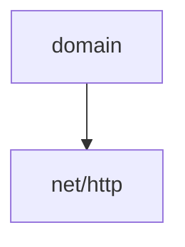
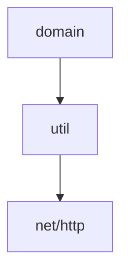

# pkgforbid

`pkgforbid` is a linter for checking if a package imports a particular package.


## Use cases

### If you want to prohibit dependencies on internal packages



### If you want to prohibit dependencies on standard libralies



### If you want to prohibit dependencies on standard libralies via  internal packages




## How to run

```
pkgforbid --config=pkgforbid.yaml ./...
```

### Config file
```
packageConfigs:
  "github.com/foo/bar/domain":
    forbiddenPackages:
      - net/http
      - database/sql
      - gorm.io/gorm
      - github.com/foo/bar/repository
  "github.com/foo/bar/service":
    forbiddenPackages:
      - github.com/foo/bar/repository
debug: false
```

